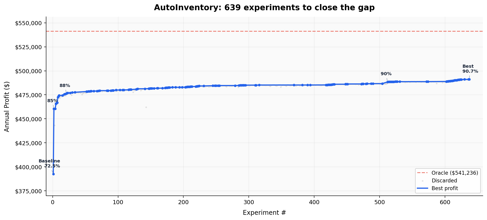

# AutoInventory



A Boston flower shop orders five products every morning with no chance to reorder.
Whatever doesn't sell is thrown away. An AI agent (Claude) edits the ordering
policy overnight, runs a deterministic simulation, and keeps or discards each
change based on measured profit. **639 experiments later, it captures 90.7% of
the theoretical maximum.**

## How it works

- **`prepare.py`** — Fixed evaluation harness. Simulates a full year of
  ordering against true (hidden) demand. Deterministic: same policy always
  produces the same profit. The agent never modifies this file.
- **`policy.py`** — The ordering policy. This is the only file the agent edits.
  It receives the day, product, censored sales history, and past orders, then
  returns a quantity.
- **`agenda.md`** — Written by the human. Contains the business context
  (products, costs, seasonality, risk preferences) and the experiment protocol
  the agent follows.

## Quick start

```bash
git clone https://github.com/harslan/autoinventory.git
cd autoinventory
python prepare.py          # evaluate the current policy
```

Output:

```
  Oracle profit : $    541,236  (perfect information upper bound)
  Policy profit : $    491,103  (90.7% of oracle)
```

## Project structure

```
autoinventory/
  agenda.md      # business context + experiment protocol (human-written)
  prepare.py     # deterministic simulation harness (never modified)
  policy.py      # ordering policy (agent-edited, 639 experiments)
  results.tsv    # full experiment log: commit, profit, status, description
  progress.png   # profit trajectory visualization
  CLAUDE.md      # agent instructions
```

## Design choices

**Censored demand.** When the shop sells out, we don't know how many customers
walked away. The policy only sees what was sold, never true demand. This makes
naive averaging systematically underestimate peak days.

**Cost asymmetry.** Stockouts cost lost margin ($7-$30 per unit depending on
product). Waste costs the purchase price ($3-$15). The optimal policy
over-orders slightly, especially before holidays.

**Deterministic simulation.** Fixed random seed means every $1 change is real.
No confidence intervals needed. This lets the agent run hundreds of A/B tests
in minutes.

**Censoring inflation.** When a stockout is detected, the policy inflates its
demand estimate proportional to the stockout rate — a simple correction for the
systematic undercount.

## Results

| Milestone | Profit | % Oracle | How |
|-----------|--------|----------|-----|
| Baseline (flat ordering) | $392,449 | 72.5% | Fixed quantities per product |
| Adaptive + holidays | $460,382 | 85.1% | EMA on censored sales, Valentine's/Mother's Day boosts |
| Tuned parameters | $485,209 | 89.6% | Per-product inflate coefficients, EMA alphas, exclusion windows |
| Final | $491,103 | 90.7% | Post-holiday dampeners, graduated seasonal boosts, Sunday effects |

Key discoveries along the way:
- **Post-Mother's Day Monday** is the biggest single-day miss for orchids and
  lilies — a 3.5x and 2.0x boost on the Monday after Mother's Day added ~$3,000
- **Censored demand inflation** needs to be product-specific: orchids 0.18,
  tulips 0.35, others 0.30
- **Negative EMA alpha** works for orchids — older observations are *more*
  informative than recent ones because orchid demand is stable
- **Post-holiday dampeners** (0.85x for roses/tulips after Valentine's Day)
  prevent the EMA from being inflated by holiday ordering

## License

MIT
